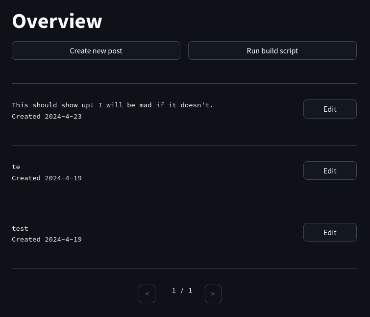

# Postream

A custom CMS I built to make writing more efficient. The project is built with Postgres, Streamlit, Docker Compose, and includes an example Svelte frontend for your next content site. The project focuses on streamlining writing creation, and statically generates the content for your site so you can host it on a CDN or wherever you want.

I'm in the process of writing an article about my motivations for this project. I will update this readme once it is done.

## Features
- Integrated Node.js build server (build your site with one button on the CMS frontend)
- Static site generation built-in
- Easily modifiable Python CMS
- Completely containerized

## How to run
Before you can run the project, you need to set your environment variables in `.env` at the top of your project directory. The variables you need to set are:
- `POSTGRES_DB`
- `POSTGRES_PORT`
- `POSTGRES_USER`
- `POSTGRES_PASSWORD`
- `CMS_PORT` - the port to access the Streamlit frontend.
- `CONTENT_PORT` - the port that the Streamlit frontend sends a request to build the project (just make sure the specified port is usable).

Then, just:
1. `mkdir build` at the top of your cloned repository. This is where the output of the build will be copied to.
2. `docker-compose up`. Starts the necessary containers and runs the project.

Once the project is up and running you can add your articles/projects/art to the database through the frontend, and run the build command in there too. Your built site will be output to the `out` folder.

## Limitations

- Not production ready
- Does not store analytics (yet)
- Limited tests for manager service

## Future Improvements
This project has met my needs, however in the future I may come back to this project to add a few other features that I think would be nice to have.

- Analytics (re. limitations)
- Hot reloading/watch command
- Managed cloud hosting
- Automatic site deployment
- User management
- Preview components for the Streamlit frontend
